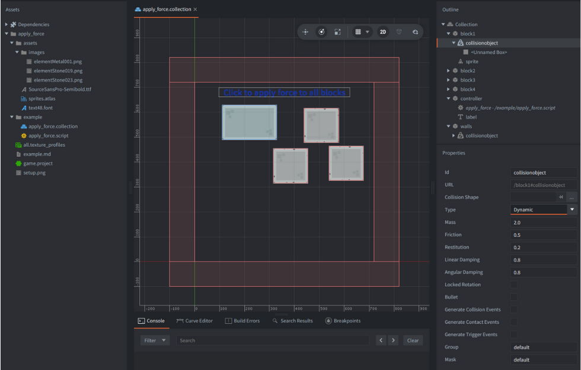
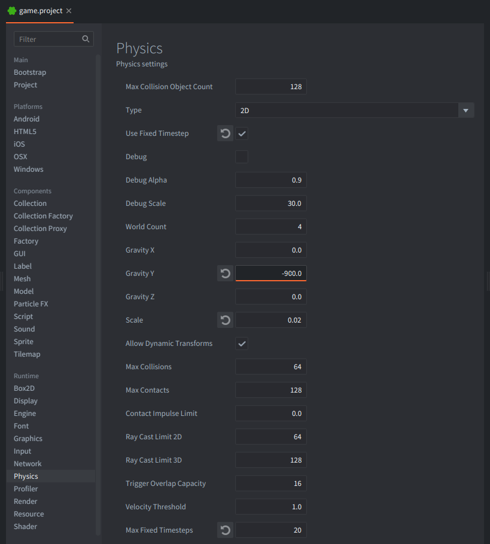

This example demonstrates how to apply directional force to all dynamic blocks on touch/click and draws debug direction lines.

## Setup

Scene consists of a few game objects:

- `controller`
  - Main object that contains `/example/apply_force.script` and a label with usage text.
- `block1`, `block2`, `block3`, `block4`
  - Dynamic rigid bodies (sprite + dynamic collision object).
- `walls`
  - Static boundary collision object around the screen.

Proposed settings regarding physics in the `game.project` file:

## Script flow

A single controller script handles input for the whole scene.  
When you touch/click, it loops over all dynamic blocks, computes a force vector for each one, applies the force, and draws a debug line that visualizes the direction.

1. acquires input focus in `init()`
2. listens to `hash("touch")` in `on_input()`
3. iterates over all block ids
4. computes `force = (touch - center) * force_factor`
5. posts `apply_force` to each block
6. posts `@render: draw_line` for debug visualization
