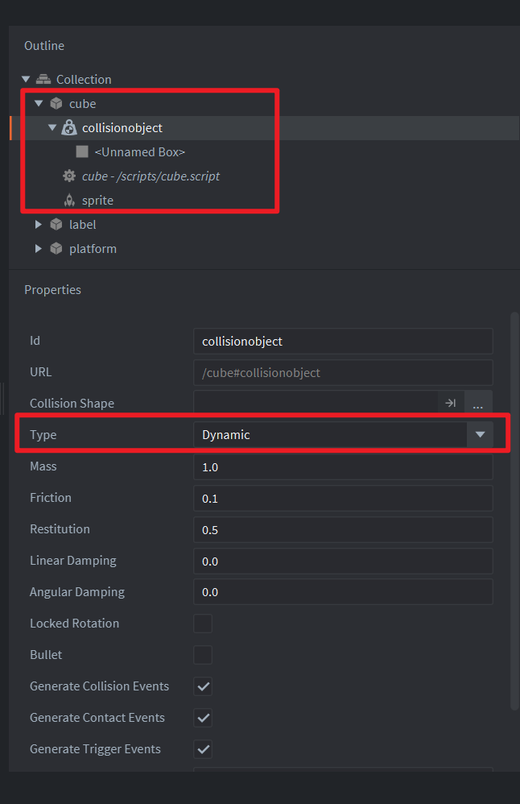

This example shows how a Box2D body can be pushed instantly with a linear impulse.

## What You'll Learn

- How to get the Box2D body from a collision object.
- How to apply an impulse at a world position.
- How to receive touch and mouse input in a script.

## Setup

The collection contains a cube game object with a sprite, a dynamic collision object, and `/example/apply_linear_impulse.script`. A static platform collision object catches the cube after the impulse. The project enables fixed-step physics and uses Box2D through Defold's built-in `b2d` API.

## How It Works

The script acquires input focus and listens for the built-in `touch` action. When the player clicks or touches the screen, it gets the cube's Box2D body, reads the body's current center of mass, and applies an upward linear impulse at that point.

Read more about the [Box2D API here](https://defold.com/ref/stable/b2d-lua/).
