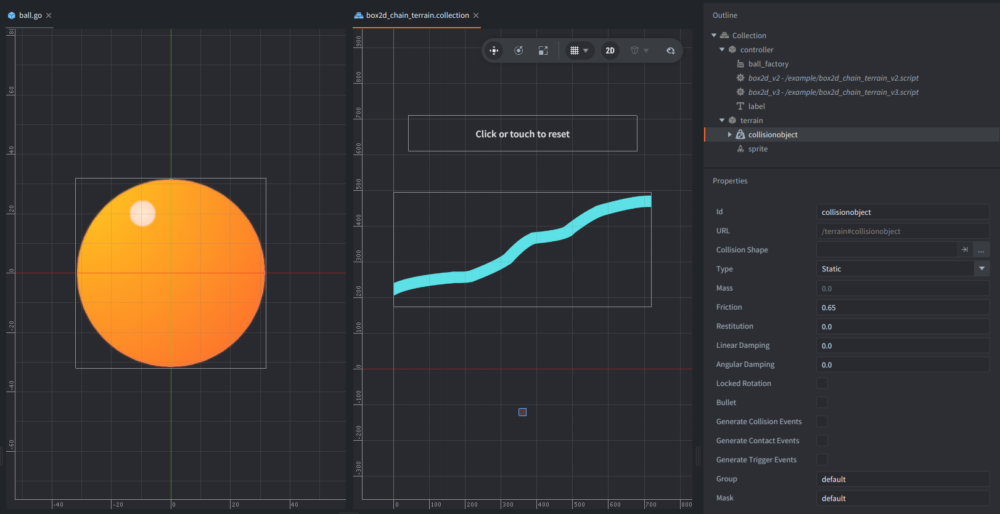
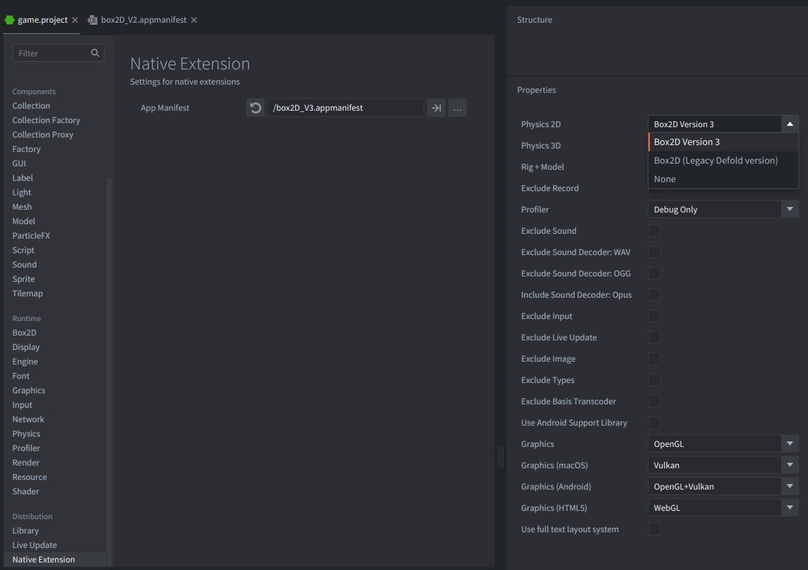

---

tags: physics, box2d
title: Box2D Chain Terrain
brief: Create Box2D chain terrain from script using Box2D V2 legacy and Box2D V3.
author: Defold Foundation
scripts: box2d_chain_terrain_v3.script, box2d_chain_terrain_v2.script
thumbnail: thumbnail.webp
-------------------------

This example creates connected Box2D chain terrain at runtime. It works with both Box2D V2 legacy and Box2D V3 by attaching one script for each backend. Each script checks `b2d.get_version()` during `init()` and becomes a no-op when the other backend is active.

Click or tap the window to reset the ball and watch it roll over the same chain again.

## What You'll Learn

* How to get a Box2D body from a Defold collision object
* How to detect the active Box2D version with `b2d.get_version()`
* How to create chain terrain with `b2d.body.create_fixture()` in Box2D V2 legacy
* How to create chain terrain with `b2d.body.create_chain()` in Box2D V3

## Setup

The collection contains a static `terrain` game object with one collision object. This is required because the runtime-created terrain must be attached to an existing Box2D body. Defold creates that body from the collision object in the collection.

The small box shape on `terrain` sits below the view. It acts as a simple body holder for the runtime chain. The example does not remove this placeholder shape, because it is outside the visible play area and does not affect the rolling ball. The visible terrain is the chain itself, drawn with `@render:draw_line`.

The `controller` game object has both backend scripts, a label, and a local factory component named `ball_factory`. The factory points at `/example/ball.go`, a shared prototype with one sprite and one dynamic circle collision object.

The `game.project` of this example is configured to build with `/box2D_V3.appmanifest` by default. To test V2 locally after downloading the example, change `Native Extensions -> App Manifest` in `game.project` to `/box2D_V2.appmanifest`.

## How It Works

Both scripts read `b2d.get_version()` once. `box2d_chain_terrain_v2.script` only continues when the major version is 2, while `box2d_chain_terrain_v3.script` only continues when the major version is 3.

`b2d.get_body()` returns the Box2D body owned by the hidden `terrain` collision object. The active script then builds the chain with the backend-specific chain API.

There is a significant difference between Box2D V2 (Legacy Defold version) and V3.

In Box2D V2 legacy, the script uses `b2d.body.create_fixture()`. In Box2D V2, a fixture attaches a collision shape and its material properties to a body. The script creates one fixture on the terrain body and gives it a chain shape definition.

In Box2D V3, the script uses `b2d.body.create_chain()`. V3 does not use the V2 fixture concept for this chain API. Instead, the chain is created directly on the body, and Box2D creates the segment shapes internally.

Both versions use the same terrain points, previous ghost vertex, and next ghost vertex. The ghost vertices are placed just outside the first and last terrain points. They do not add visible terrain segments; they tell Box2D how the open chain would continue past its endpoints, which helps keep endpoint collision normals consistent.

The script redraws the chain vertices each frame with `@render:draw_line`, because the chain is a physics object and has no sprite. The ball is created from the factory, given an initial velocity with `b2d.body.set_linear_velocity()`, and then reset on a timer or when the user clicks or taps.
