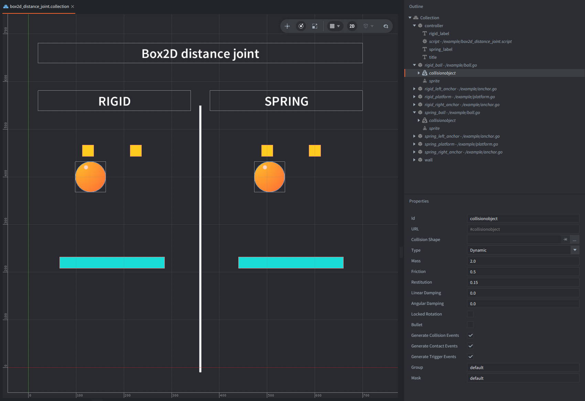

A distance joint keeps two body anchor points at a specified distance. It can also behave like a damped spring when spring behavior, hertz, and damping ratio are configured.

This example suspends two platforms from pairs of distance joints. Identical balls drop onto both at the same time: the rigid platform preserves both joint lengths, while the spring platform stretches, rebounds, oscillates, and settles.

The balls are dropped automatically every 5.5 seconds.

## What You'll Learn

- How to create distance joints with `b2d.joint.create_distance()`
- How local anchors connect a platform at two distinct attachment points
- How `enable_spring`, `hertz`, and `damping_ratio` configure rigid and spring behavior
- How to read current world-space joint anchors for visualization
- How to reset existing physics bodies for a repeated demonstration
- How to repeat an action with `timer.delay()`

## Setup

The collection contains two arrangements separated by a static wall divider:

`rigid_left_anchor`, `rigid_right_anchor`, and `rigid_platform`
: Two static supports and one dynamic platform connected by rigid distance joints.

`spring_left_anchor`, `spring_right_anchor`, and `spring_platform`
: An identical arrangement whose distance joints use a spring frequency of 1.35 Hz and a damping ratio of 0.25.

`rigid_ball` and `spring_ball`
: Identical dynamic balls that are reset at the same height to drop on the platforms in the scene.

`controller`
: Contains the shared script and the labels with information, like title, hint, `RIGID`, and `SPRING`.

`wall`
: A static vertical divider between the two arrangements.

The `game.project` of this example is configured to build with `/box2d_v3.appmanifest` by default.
To test V2 locally after downloading the example, change `Native Extensions -> App Manifest` in `game.project` to `/box2d_v2.appmanifest`.

## How It Works

Each platform is connected at two points near its ends. A distance joint constrains only the separation between its two anchors, so the platform remains free to swing, tilt, and rotate. This differs from a revolute joint, which brings two local anchors together at one shared hinge point while allowing relative rotation.

For the rigid setup, both joints have a fixed length and spring behavior is disabled. The upper anchors are closer together than the platform attachment points, which lets an off-center impact visibly couple sideways swing with platform rotation. For the spring setup, the same length is used as the spring rest length, with a given frequency and a damping ratio. Hertz controls how quickly the spring responds and therefore how stiff it feels. Damping ratio controls how quickly oscillation is removed.

Every frame, the script calls `b2d.joint.get_anchor_a()` and `b2d.joint.get_anchor_b()` and draws a line between those current world-space positions. The lower endpoints therefore stay attached to the correct points as each platform moves and rotates.

The same two authored ball bodies are moved back above the platforms every few seconds by a repeating `timer.delay()`. Their linear and angular motion is reset, so the comparison repeats without factories or accumulating objects.
