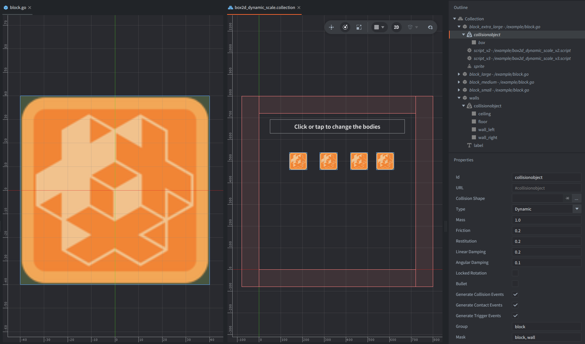

This example shows how to change bodies shapes and mass in runtime.

It includes 4 independent dynamic Box2D bodies.

Click or tap to give every square body a new random size,
update its collision shape, recalculate its mass, and apply a random  impulse.

## What You'll Learn

- How to get a Box2D body from a Defold collision object
- How to detect the active Box2D version with `b2d.get_version()`
- How to resize collision geometry through the V2 fixture API
- How to resize collision geometry through the V3 shape API
- How `update_mass = true` makes body mass follow the new collision size
- How to apply a dynamic impulse to the body

## Setup

The collection contains four instances of `block.go` game object.
The `block.go` prototype contains:

- `script_v3`, which runs only with the Box2D V3 backend
- `script_v2`, which runs only with the Box2D V2 backend
- a square sprite
- a dynamic box collision object with base half-extents of `40.0`

The collection also contains `walls` game object with:

- one static collision object with four box shapes around the play area
- a label that explains the click or tap interaction.

The `game.project` of this example is configured to build with `/box2d_v3.appmanifest` by default.
To test V2 locally after downloading the example, change `Native Extensions -> App Manifest` in `game.project` to `/box2d_v2.appmanifest`.

## How It Works

Both scripts read `b2d.get_version()` in `init()` and are only active if a matching version is used -
`box2d_dynamic_scale_v2.script` only continues when the major version is 2,
while `box2d_dynamic_scale_v3.script` only continues when the major version is 3.

The active script acquires input focus and initialized a random number generator.

When the built-in `touch` action is pressed, each block picks a random uniform scale from `0.5` to `1.5`.
The script multiplies the base sprite size and base collision half-extent by that scale,
so the visible square and physics box stay aligned.

The mass changes because `update_mass = true` makes Box2D recalculate the body mass from the resized shape.

In Box2D V2, collision geometry is attached to a body through fixtures.
The V2 script reads the first fixture with `b2d.body.get_fixtures()`
and resizes it with `b2d.fixture.set_shape(body, fixture.index, shape, true)`.

In Box2D V3, collision geometry is attached through shapes.
The V3 script reads the first shape with `b2d.body.get_shapes()`
and resizes it with `b2d.shape.set_shape(shape.shape_id, shape, true)`.

After resizing, the active script applies a random linear impulse at the body's world center.
Since each body has just recalculated its mass from its new collision size,
the resulting movement makes the size and mass changes visible.
