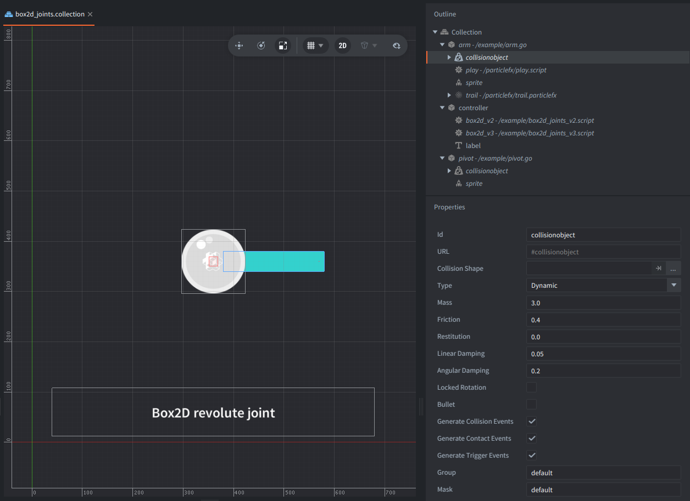

This example shows the same revolute joint setup running on both Box2D backends. Switch `game.project` between `box2D_V2.appmanifest` and `box2D_V3.appmanifest` to compare the scripts.

## What You'll Learn

- How to get the current Box2D world with `b2d.get_world()`.
- How to get body handles with `b2d.get_body()`.
- How to create and control a revolute joint with `b2d.joint`.
- How to use `b2d.world` tuning alongside the joint API in Box2D V3.

## Setup

The collection contains a static pivot, one dynamic arm with a simple particlefx to highlight the movement, and a controller game object.
The controller has both scripts attached. Each script checks `b2d.get_version()` and only runs when the selected app manifest matches its Box2D backend.

## How It Works

The project selects the Box2D scripting runtime through the app manifest in `game.project`. Use `/box2D_V2.appmanifest` to run `box2d_joints_v2.script`, or `/box2D_V3.appmanifest` to run `box2d_joints_v3.script`.

Both scripts read the pivot and arm positions from the collection, convert the pivot position to an arm-local anchor, and pass the resulting body handles and anchors to `b2d.joint.create_revolute()`.
Gravity is disabled for the arm so the example demonstrates motor direction only. The joint uses a motor without angular limits, so the arm can rotate freely in either direction.
The V3 script uses the same joint definition and also tunes the world joint solver with `b2d.world.set_joint_tuning()`.

Click or tap to reverse the motor with `b2d.joint.set_motor_speed()`.
