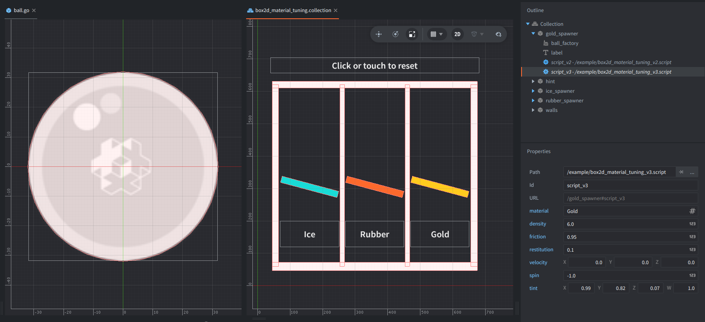
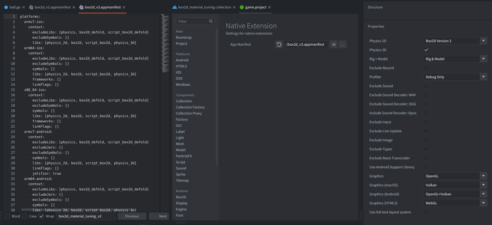

This example compares three dynamic balls whose Box2D material properties are tuned from script. It ships with one script for Box2D V3 and one for Box2D V2 (Legacy Defold version). Each controller carries both components, and the script matching the active backend does the work while the other returns immediately.

Click or tap the window to reset the balls and watch the comparison again.

## What You'll Learn

- How to get a Box2D body from a Defold collision object
- How to read and tune a V2 fixture with `b2d.body.get_fixtures()` and `b2d.fixture`
- How to read and tune a V3 shape with `b2d.body.get_shapes()` and `b2d.shape`
- How to switch the project between Box2D V2 and V3 with app manifests

## Setup

The collection contains three spawner game objects, one for each material: Ice, Rubber, and Gold. Each spawner carries two script components, one for V3 and one for V2, plus a label component and a local factory component named `ball_factory`.

All three factories point at `/example/ball.go`, a shared prototype with one sprite and one dynamic circle collision object. The script creates the ball at the spawner's position, tints the spawned sprite, and gives it starting velocity and spin from the spawner's script properties.

The material comparison comes from per-instance script property overrides:

<kbd>Ice</kbd>
: Low friction and low restitution, so the ball slides along the ramp.

<kbd>Rubber</kbd>
: Medium friction and high restitution, so the ball bounces a bit.

<kbd>Gold</kbd>
: High density, high friction, and almost no restitution, so the ball settles quickly.

The static scene is built from walls, two lane dividers, and three ramps. The ramps use the `pixel_blue`, `pixel_orange`, and `pixel_gold` atlas animations to match the three spawner labels.

The `game.project` of this example is configured to build with `/box2d_v3.appmanifest` by default. To test V2 locally after downloading the example, change `Native Extensions -> App Manifest` in `game.project` to `/box2d_v2.appmanifest`.

## How It Works

`go.property()` exposes the material settings on each script instance, so the Ice, Rubber, and Gold spawners can use the same values in both backend scripts. The label is addressed as `#label`, because it is attached to the same game object as the scripts.

`b2d.get_body()` returns the Box2D body owned by the spawned collision object. The V2 script reads the first fixture with `b2d.body.get_fixtures()` and uses the `b2d.fixture` API to update density, friction, and restitution.

The V3 script reads the first shape with `b2d.body.get_shapes()` and uses the `b2d.shape` API to update density, friction, and restitution. After changing density, it calls `b2d.body.reset_mass_data()` so the body mass reflects the new value immediately.

Clicking or tapping makes each active spawner delete its current ball, spawn a fresh one from its own factory, and reapply its material settings for the current backend.
