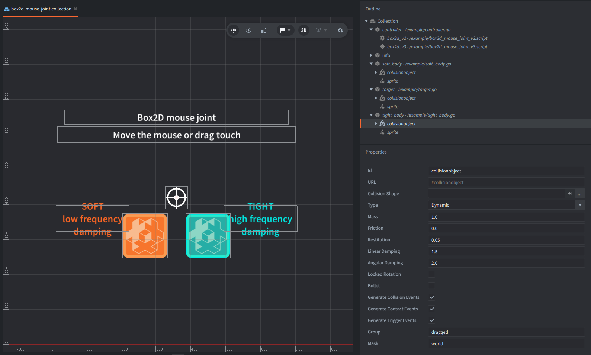

This example shows how to create and control Box2D mouse joints from Lua. A visible target point moves automatically until you move the mouse or drag a touch point. Two dynamic bodies follow the same target with different spring settings, making the softer joint stretch behind the target while the tighter joint follows more closely.

## What You'll Learn

- How to get Box2D bodies from collision object components with `b2d.get_body()`.
- How to create a mouse joint with `b2d.joint.create_mouse()`.
- How `frequency` (V2) or `hertz` (V3), `damping_ratio`, and `max_force` affect spring-like motion.
- How to update the joint target every frame with `b2d.joint.set_mouse_target()`.

## Setup

The collection contains 5 game objects:

`controller`
: Contains both backend scripts, `box2d_mouse_joint_v2.script` and `box2d_mouse_joint_v3.script`. Each script checks the active Box2D version and only one script runs.

`target`
: Contains the visible target sprite and a static collision object. The static body is used as the mouse-joint anchor.

`soft_body`
: Contains the orange sprite and a dynamic collision object. This body is connected with lower spring frequency/hertz and damping, so it follows the target more softly.

`tight_body`
: Contains the blue sprite and a dynamic collision object. This body is connected with higher spring frequency/hertz, damping, and max force, so it follows the target more tightly.

`info`
: Contains labels for the soft body, tight body, input instruction, and active Box2D backend.

The project uses `box2D_V2.appmanifest` by default. To compare the newer backend, switch the native extension app manifest in `game.project` to `box2D_V3.appmanifest`.

## How It Works

The mouse joint connects the invisible static body to a dynamic body. The joint does not move the body instantly. Instead, it applies a limited spring-damper force toward the target position. This is why the body can stretch, overshoot, and settle.

The V2 script uses `frequency` and `damping_ratio` in the joint definition. The V3 script uses `hertz` and `damping_ratio`. Both scripts then call `b2d.joint.set_mouse_target()` every frame so the target can move continuously.

The example creates two mouse joints with different values. The orange body uses a lower frequency/hertz and lower damping, so it visibly lags behind. The blue body uses a higher frequency/hertz, more damping, and a larger max force, so it feels tighter and follows the target more directly.
