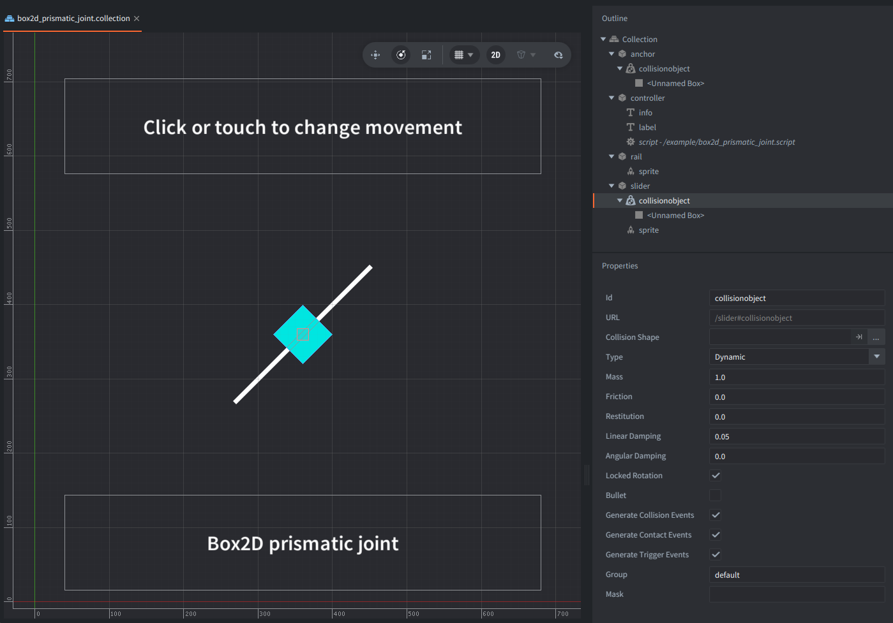

This example creates a Box2D prismatic joint at runtime.
The blue dynamic body (slider) is constrained to a diagonal rail,
moves between two translation limits, and reverses its motor when it reaches either end.

Click or tap the window to reverse the motor manually.

There are no differences in scripting between Box2D V2 and V3 in this example.

## What You'll Learn

- How to get Box2D body handles from Defold collision objects
- How to create a prismatic joint with `b2d.joint.create_prismatic()`
- How `local_axis_a`, `lower_translation`, and `upper_translation` define the slide rail
- How to control a prismatic joint motor with `b2d.joint.set_motor_speed()`

## Setup

The collection contains:

- `controller` game object with the main script and labels with informations
- `rail` game object with static collision object for frame reference for the prismatic joint and a sprite rotated by 45 degrees around Z axis to indicate the "rail"
- `slider` game object with a dynamic collision object and a sprite to indicate where the slider is 

The `rail` and `slider` bodies start at the same world position in the middle.

The `game.project` of this example is configured to build with `/box2d_v3.appmanifest` by default.
To test V2 locally after downloading the example, change `Native Extensions -> App Manifest` in `game.project` to `/box2d_v2.appmanifest`.

## How It Works

The script uses `b2d.get_body()` to fetch the Box2D bodies owned by the `rail` and `slider` collision objects.
Then calls `b2d.joint.create_prismatic()` which creates the prismatic joint between them,
with `local_axis_a` set to the same diagonal direction as the visible rail (rotated 45 degrees areound Z axis),
enables limits from `-110` to `110` project units, and a motor, sets a maximum motor force, and starts the slider moving along the rail.

The prismatic joint is a constraint solver - only defines *how* two bodies are allowed to move, not *why* they should move.
So normally, the slider would fall in the gravity direction, but would be moving constrained like a slider along a rail.
We enable the motor in the example to move in both direction along the rail.
Motor applied on a prismatic joint moves the object along the joint axis at the given linear speed.

During `update()`, the script reads `b2d.joint.get_joint_translation()`, which returns the position alongside the constraint,
and reverses the motor when the translation reaches either limit.

On input (touch or mouse click) the direction of the motor that applies force to the slider changes too.

