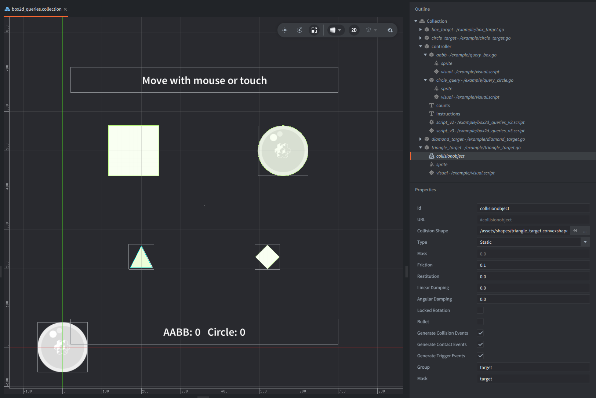

This example places four static targets with box, circle, triangle, and diamond collision shapes, and a user controllable circle shape query.
Move the mouse or drag to move the circle query area, watch the hit counts, and see the query overlays, target shapes, and AABB (Axis Aligned Bounding Box) outlines change color.

It ships with app manifests for Box2D V3 and Box2D V2 (legacy Defold version).
The project is configured to build with the V3 app manifest by default, and the same script works with both Box2D backends.

## What You'll Learn

- How to get the active Box2D world with `b2d.get_world()`.
- How to build AABB and circle overlap queries.
- How to use `b2d.world.overlap_aabb()` and `b2d.world.overlap_shape()`.
- How to read query result tables and use them.
- How to handle the Box2D V2 and V3 query result table differences.
- How to draw temporary AABB helper lines through the render socket.

## Setup

The collection contains one `controller` game object with the query script, and two visual query overlays: one AABB box and one circle shape sprite.
The overlay objects only show where the scripted queries are being run - they do not have collision objects.

Additionally, there are four static target objects with collision objects with shapes: one box, one circle, and two convex hull collision shapes - a triangle and a diamond (rotated square),
and sprites for visual representation of the shape. The line rectangles in runtime show the target broad-phase AABBs used by the query feedback.

The `game.project` of this example is configured to build with `/box2d_v3.appmanifest` by default. To test V2 locally after downloading the example, change `Native Extensions -> App Manifest` in `game.project` to `/box2d_v2.appmanifest`.

## How It Works

The controller stores the mouse or touch position and uses `update()` to drive the query shapes each frame.
An AABB and a circle are tested directly against the Box2D world at the pointer position.

Each query uses the Box2D scripting API directly.

Unlike sensors or triggers, the query calls do not create persistent detector objects or send physics messages.
They immediately return the fixtures or shapes hit by the query for the current frame.

The AABB query builds a table with `lower` and `upper` vector fields, then passes it to `b2d.world.overlap_aabb()`.
The circle query builds a shape table with `type`, `center`, and `radius`, then passes it to `b2d.world.overlap_shape()`.

The collection has one query controller script.
The script reads bodies directly from fixture hits in V2, while in V3 it reads bodies from shape hits with `b2d.shape.get_body()`.
The hit body's position is then matched against the cached target positions so the controller can update the correct target game object.
The script caches the four static target positions and their defined AABBs at startup.

The important backend difference is the query result format:
Box2D V2 returns fixture hit tables, and each hit has the body available directly as `hit.body`.
Box2D V3 returns shape hit tables instead, so the script reads `hit.shape_id` and calls `b2d.shape.get_body(hit.shape_id)` to get the owning body.
After that, the rest of the example uses the body in the same way for both backends.

In `update()`, the query controller directly moves the query overlay sprites, changes target sprite colors, and draws the helper outlines.
The controller updates the count label to display how many fixtures or shapes each query detects.
The target AABB helper outlines are drawn from the same defined AABB data used by the visual feedback.
The helper visual outlines are created using `draw_line` messages sent to `@render:` every frame, which then draws the debug lines on top.
