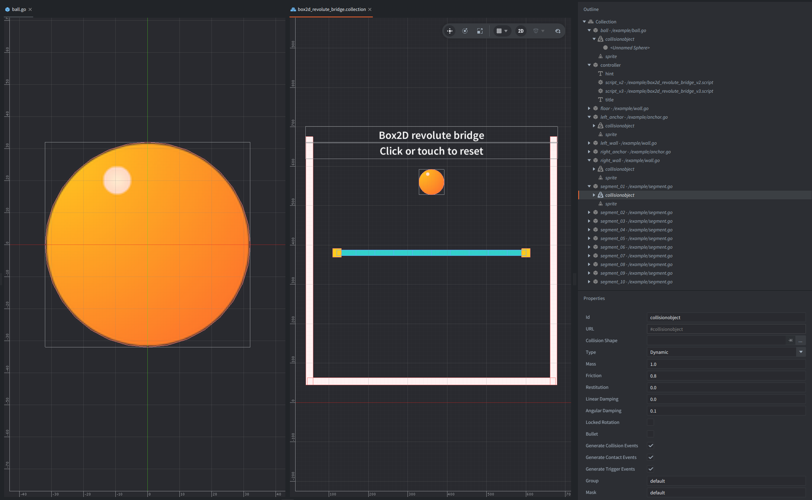

This example builds a simple rope bridge from rectangular dynamic bodies connected with Box2D revolute joints.
A ball drops onto the bridge so the hinge chain bends under load.

Click or tap the window to reset the ball.

## What You'll Learn

- How to get Box2D bodies from Defold collision objects with `b2d.get_body()`
- How to connect two bodies with a `revolute` type joint
- How local joint anchors define hinge points on each connected body

## Setup

The collection contains these game objects:

`controller`
: Contains both backend scripts, `box2d_revolute_bridge_v2.script` and `box2d_revolute_bridge_v3.script`, plus the title and hint labels. Each script checks the active Box2D version and only one script runs.

`left_anchor` and `right_anchor`
: Static collision objects used as the fixed bridge supports.

`segment_01` to `segment_10`
: Dynamic rectangular collision objects. The active script creates revolute joints between neighboring segments.

`ball`
: A dynamic circle collision object that falls onto the bridge to show how the joints move.

`floor`, `left_wall`, and `right_wall`
: Static collision objects that keep the simulation in view after the ball falls through or off the bridge.

The project uses `box2d_v3.appmanifest` by default, so it runs with Box2D V3.
To use the older legacy V2 backend, switch the native extension app manifest in `game.project` to `/box2d_v2.appmanifest`.

## How It Works

Both scripts use the same collection-authored bodies. `b2d.get_body()` returns the Box2D body owned by each collision object, and `b2d.joint.create_revolute()` creates the hinge constraints at runtime.

Each bridge segment is 48 pixels wide. The script connects the right edge of one body to the left edge of the next body by using local anchors: `(24, 0, 0)` on the previous segment and `(-24, 0, 0)` on the current segment.
The first and last joints connect to static anchors at the bridge supports.

On reset, the script moves the ball up and drops it onto the bridge again. The joints are created once in `init()` and destroyed in `final()`.
