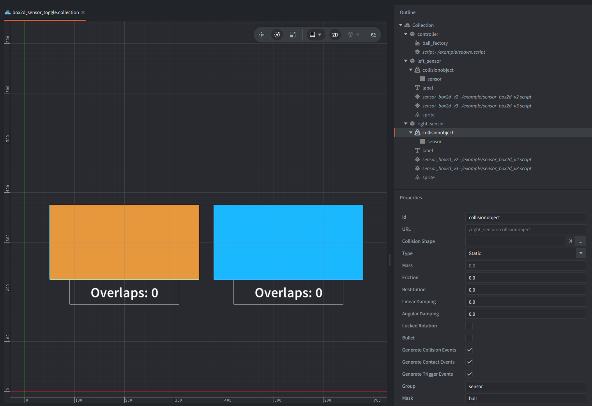

This example shows how to utilize the Box2D scripting API to operate with sensors (triggers).
It spawns dynamic physics balls from slightly different random positions near the top of the scene,
and gravity pulls each ball down, and these pass through two collision objects.

## What You'll Learn

- How to get a Box2D body from a collision object with `b2d.get_body()`.
- How to turn a Box2D V2 fixture into a sensor with `b2d.fixture.set_sensor()`.
- How to recreate a Box2D V3 shape as a sensor with `b2d.body.create_shape()`.
- How to count V2 sensor overlaps from `trigger_response` enter/exit messages.
- How to poll V3 sensor overlaps with `b2d.shape.get_sensor_overlaps()`.

## Setup

The collection contains one `controller` game object with `spawn.script` and a `ball_factory`.
The factory creates `ball.go` - a small prototype with one sprite and one dynamic circle collision object.

The two sensor game objects both contain:

- `sensor_box2d_v3.script` - for Box2D V3 example handling
- `sensor_box2d_v2.script` - for Box2D V2 example handling
- A sprite, label, and static collision object with component id `collisionobject`.

The collision objects are of type `Static` in the editor.

All sensors use the `sensor` collision group and mask the `ball` group.
The spawned ball belongs to the `ball` collision group and masks the `sensor` group,
so the sensor overlaps only include spawned balls.

The `game.project` currently uses `/box2d_v3.appmanifest`.
To test V2 locally, change `Native Extensions -> App Manifest` to `/box2d_v2.appmanifest`.
Gravity set in `game.project` causes the falling motion.

## How It Works

The controller spawns a ball repeateadly with `factory.create()`.
Each ball is spawned at a random X position near the center, and is deleted after a short delay.
The spawned balls pass through the sensor's collision object shapes.

Each sensor has two backend scripts (V2 and V3), but only one runs processing depending on a choosen Box2D version.
Each script checks `b2d.get_version().major` in `init()` and returns immediately when the active backend does not match.

At startup, the active Box2D script changes the static collision geometry into a sensor (trigger) through the `b2d` API.
Box2D V2 and V3 expose this through different scripting APIs:

- V2 uses fixtures and Defold trigger messages.
- V3 uses shapes and can poll a sensor shape's current overlaps directly.

In Box2D V2, `sensor_box2d_v2.script` gets the body with `b2d.get_body("#collisionobject")`,
reads the first fixture with `b2d.body.get_fixtures()`, and calls `b2d.fixture.set_sensor()`,
so the fixture no longer blocks the balls. V2 fixture sensors do not expose a `get_sensor_overlaps()` polling API.
But Defold still sends `trigger_response` messages when another collision object enters or exits the sensor,
and the script maintains a Lua table of current overlapping ball ids.

In Box2D V3, `sensor_box2d_v3.script` uses the shape API.
It reads the first editor-authored shape with `b2d.body.get_shapes()` and `b2d.shape.get_shape()`,
destroys that solid shape, and creates a replacement with `b2d.body.create_shape()` using the same geometry and `sensor = true`.
The V3 script then calls `b2d.shape.enable_sensor_events()` for the new sensor shape.
In `update()`, it polls the current overlaps with `b2d.shape.get_sensor_overlaps()`.
This returns shape info tables for the shapes currently overlapping the sensor.

Both scripts gives us the same result: each sensor sprite scales up while at least one ball overlaps it,
and the label shows the current overlap count reported by the active backend path.
