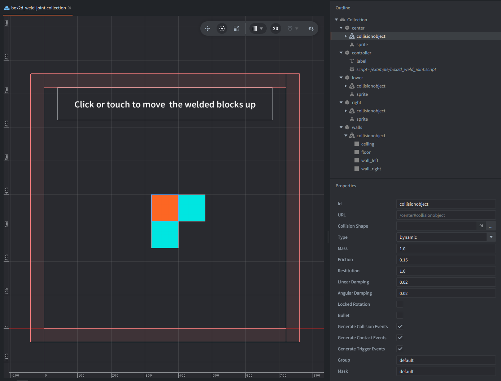

This example creates two Box2D weld joints at runtime between three separate dynamic square bodies.
They form an L-shaped cluster and are put inside a static wall box.
The weld joints keep the pieces together, while the whole assembly collides and bounces.

Click or touch the screen to kick one of the welded bodies upward and watch the whole cluster react.

There are no differences in scripting between Box2D V2 and V3 in this example.

## What You'll Learn

- How to get Box2D body handles from Defold collision objects
- How to create rigid weld joints with `b2d.joint.create_weld()`
- How local weld anchors define where two bodies are attached
- How changing one welded body's velocity affects the whole connected cluster

## Setup

The collection contains
- `controller` game object with the script and a label with information text
- three game objects: `center`, `right`, and `lower` with dynamic collision objects and visual sprite representations
- a single `walls` game object with static collision object that surrounds the play area with floor, ceiling, and wall shapes.

The 3 separate Defold collision objects are arranged in an L shape,
with 80 px square sprites and matching box collision shapes.
Each block has restitution set to 1.0 so the welded cluster keeps bouncing against the surrounding walls.
Because a weld joint does not turn the blocks into one true compound rigid body,
they remain separate dynamic Box2D bodies connected by a constraint solver,
so even if a block has restitution: 1.0, energy can still be lost thorugh weld joint constraint or damping.

The `game.project` of this example is configured to build with `/box2d_v3.appmanifest` by default.
To test V2 locally after downloading the example,
change `Native Extensions -> App Manifest` in `game.project` to `/box2d_v2.appmanifest`.

## How It Works

The script starts by getting the bodies owned by the collection-authored collision objects using `b2d.get_body()`.
The script stores the handles for `center`, `right`, and `lower`.

Then it calls `b2d.joint.create_weld()` twice - one weld joint from `center` to `right`, and another from `center` to `lower`.
Each weld joint uses `local_anchor_a` and `local_anchor_b` so the neighboring squares are joined at their touching edges.

The example uses only the rigid weld fields shared by both backends:
`local_anchor_a`, `local_anchor_b`, `reference_angle`, and `collide_connected`.
V2 also supports `frequency` and `damping_ratio` for soft welds,
while V3 uses separate linear and angular hertz/damping fields.
Those backend-specific spring fields are intentionally omitted here so the same script can run on both backends.

Input focus lets player clicks or touches the screen.
The script changes the linear and angular velocity of the `right` block.
The weld joints transfer that motion through the connected bodies,
so the whole L-shaped assembly kicks upward and spins while remaining rigid.

