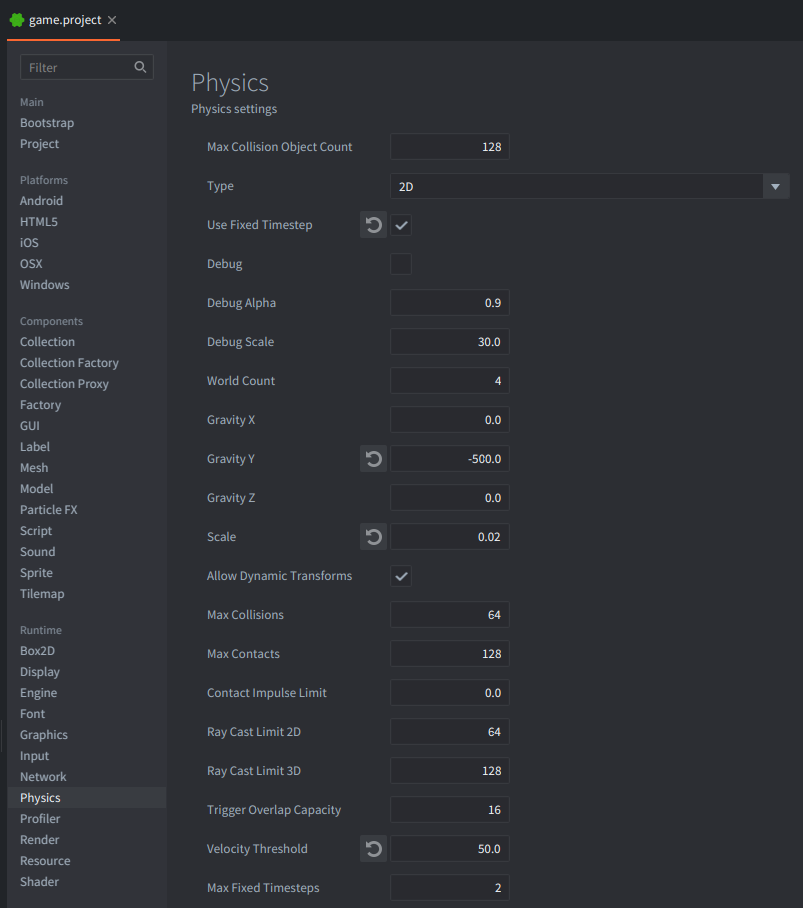
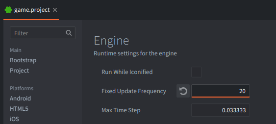
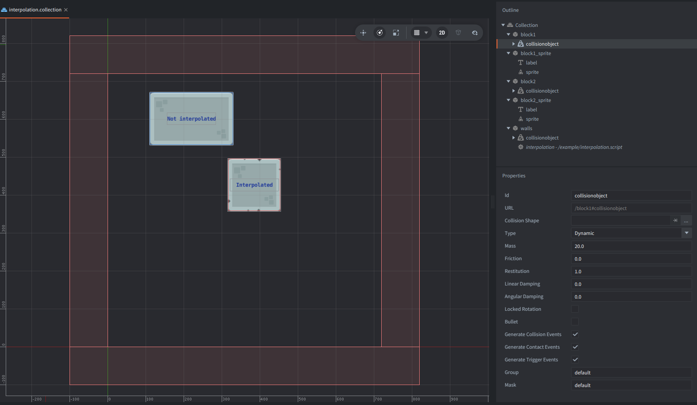

This example demonstrates two rendering paths while physics runs at a fixed frequency:
- `Not interpolated`: visual sprite follows the dynamic body directly (visually looks like it has a stepped motion).
- `Interpolated`: visual sprite is interpolated between fixed physics states (smooth motion).

The key idea is to separate physics simulation from rendering:
- Keep the transforms of the game objects with dynamic collision objects as the source of truth.
- Set position of the visual representation based on the position of the physics objects.
- Interpolate only the visual representation transform.

## Setup

In `game.project`:
1. In the `Physics` section set `Use_Fixed_Timestep` enabled and `Velocity Threshold` to 50 (It is necessary for 2D physics, because velocity threshold is scaled with the scale option, and in the end it should be 1.0 internally in Box2D, so if Scale is set to 0.02, the velocity threshold should be 50 = 1.0 / 0.02). Gravity is set arbitraly for this example to -500.

2. In the `Engine` section set `Fixed Update Frequency` to a low value, e.g. 20, so the difference is easy to see.

The setup consists of 5 game objects:

`walls`
: Static borders and the script host.
  - A static *Collision object* component.
  - A script component using `/example/interpolation.script`.

`block1`
: Game Object for the non-interpolated path for the physics component.
  - A dynamic *Collision object* component.
  - No sprite (physics-only object).

`block1_sprite`
: Game Object for the non-interpolated path for the visual representation.
  - A *Sprite* component.
  - A *Label* component (with text `Not interpolated`).

`block2`
: Game Object for the interpolated path  for the physics component.
  - A dynamic *Collision object* component.
  - No sprite (physics-only object).

`block2_sprite`
: Game Object for the non-interpolated path for the visual representation.
  - A *Sprite* component.
  - A *Label* component (with text `Interpolated`).

## Script Behavior

`/example/interpolation.script`:
1. Keeps a two-sample fixed-state buffer for `block2`:
   - `previous` = previous fixed physics sample
   - `current` = current fixed physics sample
2. In `fixed_update()`, shifts values (`current` data becomes `previous` data) and samples a new `current` transform from the objects controlled by the dynamic collision objects.
3. In `update()`, computes render progress inside the current fixed interval:
   - `alpha = render_accumulator / fixed_dt`
4. Renders:
   - `block1_sprite` from raw `block1` transform.
   - `block2_sprite` from interpolated transform (position is interpolated using `vmath.lerp()`, and rotation is interpolated using `vmath.slerp()`).

## Expected Result

At runtime:
- `block1_sprite` appears updated at the fixed frequency.
- `block2_sprite` appears updated each frame.
