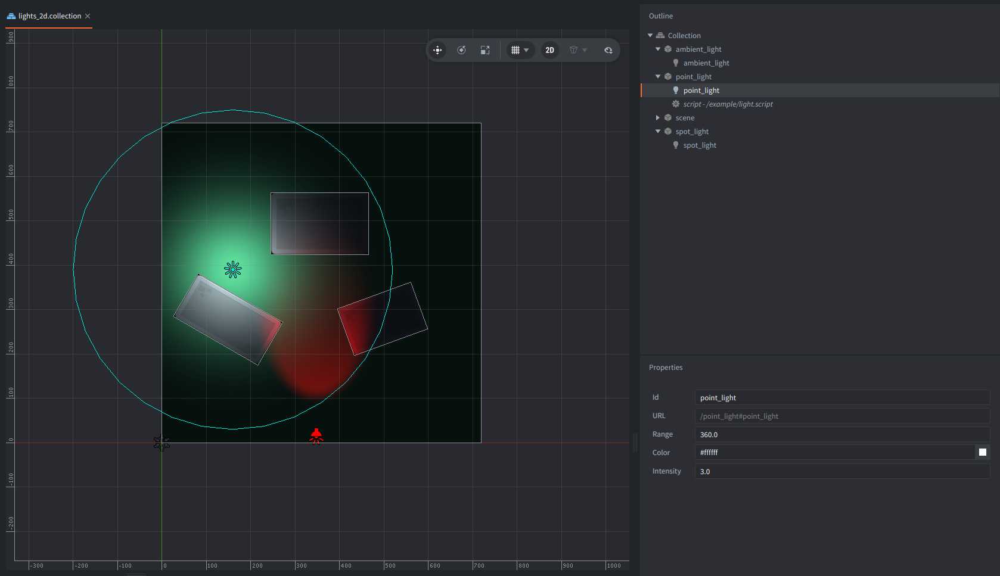
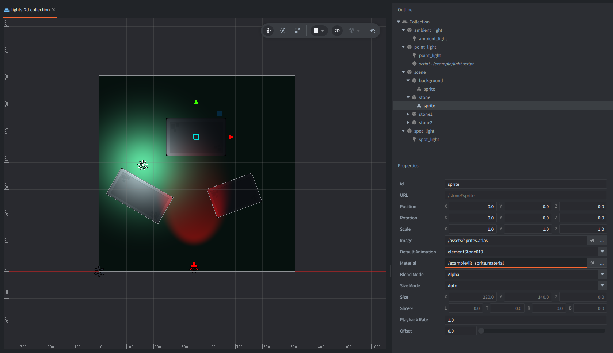
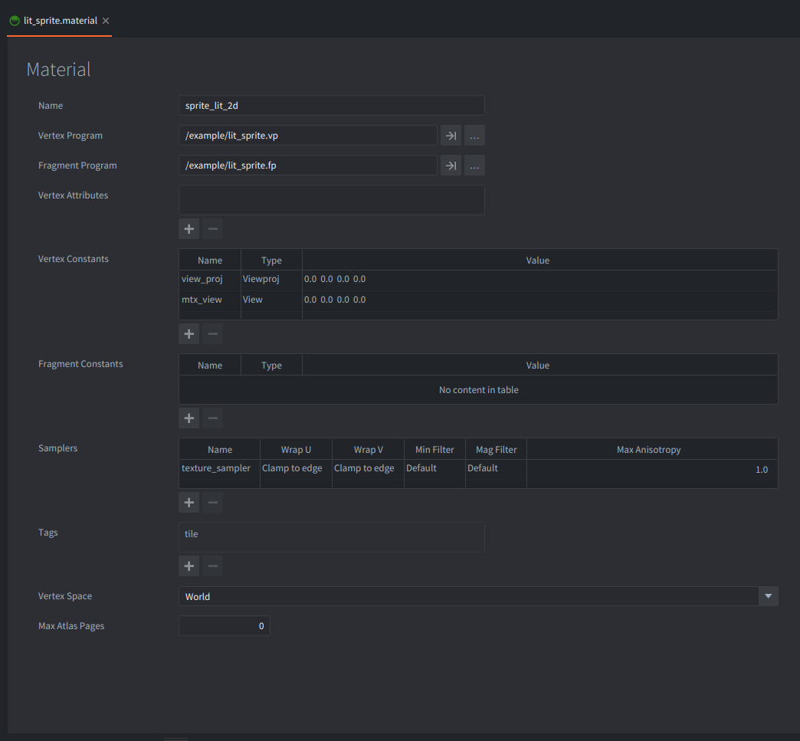

The example shows how to utilise Light components (introduced in Defold 1.13.1)
and materials to add a simple lighting to the sprites.
The light illuminates every sprite that uses the lit material.
This is a forward-lighting technique: each sprite calculates its lighting as it is drawn.

Read more about [Light components in the manual](https://defold.com/manuals/light/).

## What You'll Learn

- How a sprite shader can read and react to Light components data.
- How to use a fixed surface normal for simple 2D lighting.
- When this single-pass technique is preferable to a screen-space light map.

## Setup

The collection contains:
- `ambient_light` game object with ambient light component
- `point_light` game object with point light component and a `follow_cursor` script
- `spot_light` game object with spot light component
- `scene` consisting of game objects with sprites for background and three stones.

Sprite components of the scene elements all use `lit_sprite.material`,
which makes them respond to Light components.

The scene uses 3 lights:

- An Ambient Light with a blue-grey color and an intensity of `0.5`.
It provides the minimum illumination across the whole scene.
- A white Point Light with an intensity of `3.0` and a range of `360`.
Its game object starts at `Z = 140`, placing the light above the sprites on the positive Z axis.
The Point Light game object also contains `light.script`.
The script moves the light to the mouse cursor,
demonstrating that Light components follow their game object's world transform automatically.
- A red Spot Light with an intensity of `3.0` and a range of `800`,
outter cone angle - `50` and inner cone angle - `30`.

## How It Works

### Light component data

The engine collects light components data and exposes it to materials
whose shaders declare the built-in `LightBuffer` layout.

Ambient lights are accumulated separately as `color × intensity`.

Directional, Point, and Spot lights are stored in the light array
with their world position or direction, color, intensity, range, and type-specific values.
Read more about light components in the Lights manual.

A Point Light uses the position of its game object.
Its effective range is the component's Range multiplied
by the smallest absolute axis of the game object's world scale.
Moving or uniformly scaling the game object therefore moves
or resizes the illuminated area automatically
without a need to change shader constants from Lua.

The light component itself does not select which sprites it affects.
Any material that consumes the global light buffer can respond to it,
while sprites using the regular built-in sprite material remain unchanged.

### Vertex shader

Sprite vertices are in world space. `lit_sprite.vp` uses the material's `view_proj`
constant to project each vertex to the screen, just like a regular sprite shader.
It also uses `mtx_view` to pass the fragment position in view space to the fragment shader.

The built-in lighting functions operate in view space, so the surface position,
surface normal, and light position must all use the same coordinate space.
Passing `mtx_view` also keeps the material correct if the scene would later use a different camera.

### Fragment shader

`lit_sprite.fp` defines `MAX_LIGHT_COUNT` and includes `/builtins/materials/lighting.glsl`.
The include declares the engine-owned light buffer and provides two helpers used here:

- `ambient_light()` returns the accumulated Ambient Light contribution.
- `diffuse_lambert(normal, position)` evaluates the active Directional, Point, and Spot lights up to `MAX_LIGHT_COUNT`.

Sprites have positions and texture coordinates, but no normal vertex attribute.
This example treats every sprite as a flat surface facing positive Z
and transforms that fixed `(0, 0, 1)` direction into view space.
A Point Light must therefore have a positive Z offset:
if it were placed directly in the same plane as sprite, the light direction would be perpendicular
to the fixed normal and its Lambert contribution would be zero.

For a Point Light, the included shader calculates the contribution from three factors:

1. Light color multiplied by intensity.
2. Lambert diffuse shading: `max(dot(normal, direction_to_light), 0)`.
3. Distance attenuation: `clamp(1 - distance / range, 0, 1)²`.

The fragment shader adds the ambient and diffuse contributions,
multiplies the sampled premultiplied sprite color by the result,
and preserves the texture alpha.

### Light count

This shader sets `MAX_LIGHT_COUNT` to `4`.
The value is the maximum number of non-ambient lights this material evaluates.
It must not exceed `[light] max_count` in `game.project`.
This example leaves that project setting at its default of `64`.
If more than four non-ambient lights are active, this shader evaluates only the first four.
Ambient lights do not occupy entries in the shader array because the engine combines them into one ambient value,
although every Ambient Light still counts as a Light component in the project limit.

### Input and rendering

`light.script` acquires input focus and handles mouse movement in `on_input()`.
It copies the cursor's X and Y coordinates to the Point Light game object
while preserving the positive Z offset required by the flat surface normal.
Light transforms are read by the engine after game object updates,
so the shader receives the new world position each frame.

No custom render script or render target is needed.
The default renderer draws the sprites normally,
and the engine binds the light buffer automatically before drawing a material that declares it.

## When to Use This Technique

This approach is useful for 2D games that need colored light and smooth distance falloff.
It keeps the setup close to regulat sprite rendering
and allows the same Light components to be shared with lit 3D materials.

- Every sprite uses the same flat normal
- There are no shadows, occluders, or visibility tests - light passes across all lit sprites within range.
- The shader implements diffuse (Lambert) and ambient lighting only. It has no specular, emissive, etc.
- Every lit fragment evaluates the active lights up to `MAX_LIGHT_COUNT`,
so large scenes should choose the limit deliberately or use a more selective lighting design.

For normal-mapped 2D art, replace the fixed normal with a normal sampled from a texture
and transform it into the same coordinate space as the light calculations.

For shadows or large numbers of purely 2D lights, other techniques like e.g.
a screen-space light-map pipeline may be more appropriate.

See the Defold manuals for more detail about [materials](https://defold.com/manuals/material/), [shaders](https://defold.com/manuals/shader/), and the [render pipeline](https://defold.com/manuals/render/).

The stone image is CC0 artwork from Kenney's Platformer Art Extended pack.
