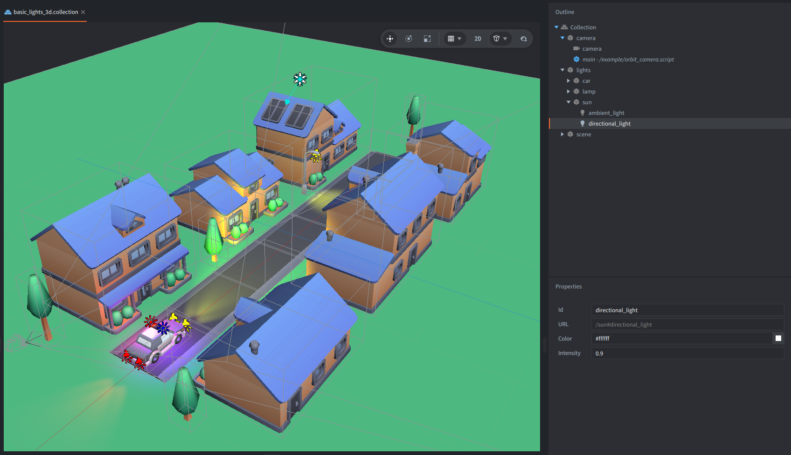
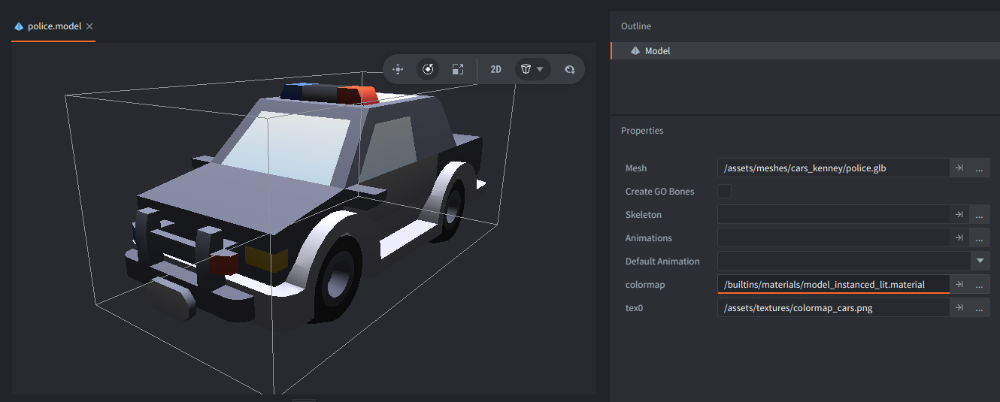
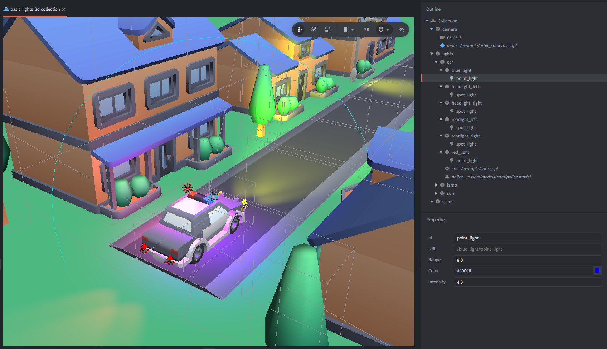
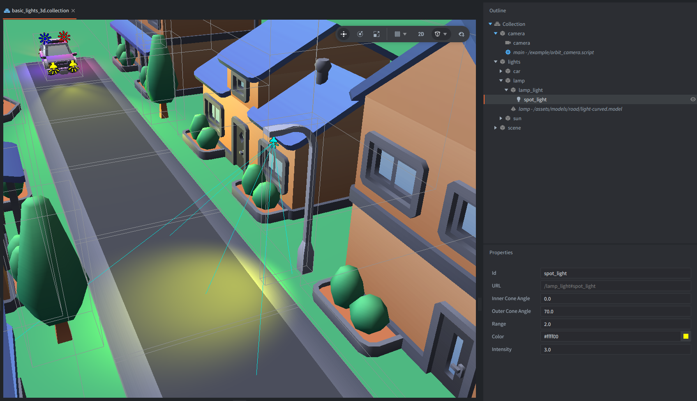

This example sets up a small 3D city scene with several light component types.
The police car moves through the street so its headlights, rear lights,
and siren lights can be seen on nearby models.

You can orbit the camera around the scene with the mouse or touch input.

## What You'll Learn

- How to add ambient, directional, point, and spot light components to a 3D scene.
- How to use built-in lit model materials that respond to light components.
- How changing or animating properties of the parent game object of light components affect them.

## Setup

The bootstrap collection `example/basic_lights_3d.collection` contains a simple city scene made from model components.
There is also:

- a camera game object with camera component and `orbit_camera.script`
- a `lights` game object that groups the scene lights, lamp, and moving car with light components

All visible models in this scene use `/builtins/materials/model_instanced_lit.material`.
Lit built-in materials are an example for model components to receive and react to the light from Defold Light components introduced in Defold 1.13.1.

You can use a material variant that matches the model:

- `/builtins/materials/model_lit.material` for a regular static model.
- `/builtins/materials/model_instanced_lit.material` for static models that utilise GPU instancing.
- `/builtins/materials/model_skinned_lit.material` for a skinned (animated) model.
- `/builtins/materials/model_skinned_instanced_lit.material` for skinned (animated( models that can be instanced.

In the model file, the `colormap` material slot has assigned `model_instanced_lit.material`,
and the texture sampler `tex0` points to the color map used by that model group.

## How It Works

The `sun` game object contains two light components.

The `ambient_light` adds a constant color to the shading of the models,
so that unlit sides of the models are not completely black.

The `directional_light` represents distant light, like sunlight,
and uses the parent game object's rotation to define the light direction.

The police siren lights on the car uses two point light components.
The point light is used as a light source that has a position in the world,
and a spherical area around it defined by the `range`.
It uses the parent's game objects position and scale.
It also has a `color` and `intensity`.

The `red_light` and the `blue_light` are child game objects of the car, so they move with it.
The `car.script` animates the scale of the two light game objects at different times,
which makes the red and blue light contribution pulse, like the police siren lights.

The headlights, rear lights, and street lamp use spot light components.
A spot light is for a light that has a volume in a shape of a cone, e.g. flashlights, lamps or car's lights.
It has the same `color`, `intensity`, and `range` controls as a point light,
plus `inner_cone_angle` and `outer_cone_angle` to shape the beam.
It uses the parent's game objects position, scale and rotation.
In this scene the headlights are yellow spot lights with a long range,
the rear lights are shorter red spot lights,
and the street lamp points downward from the lamp model.

The car movement is intentionally simple - `car.script` just animates the car position back and forth,
flips its rotation every five seconds, and animates the scale of the siren lights.
The lighting behavior itself comes from the light components and the built-in lit model materials.

All the models in the example are from [Kenney asset packs](https://kenney.nl/assets/) (Road, City and Cars), licensed under CC0.
