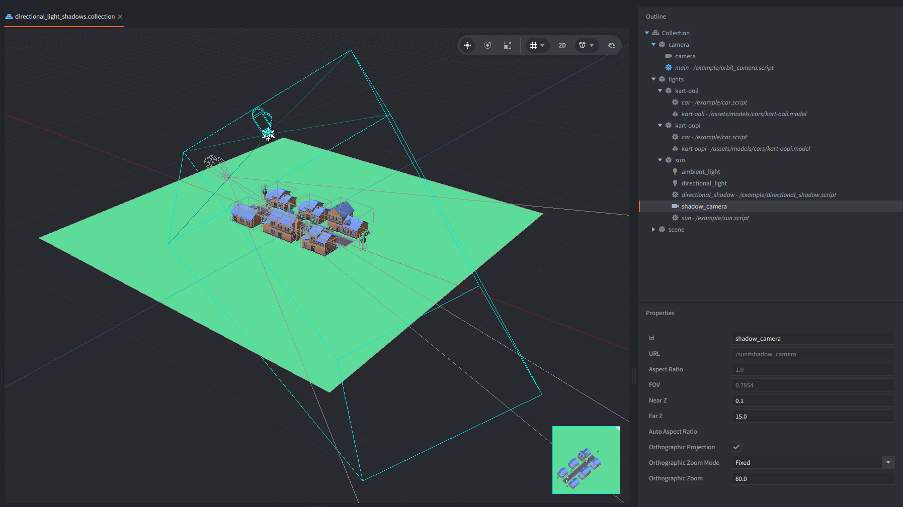
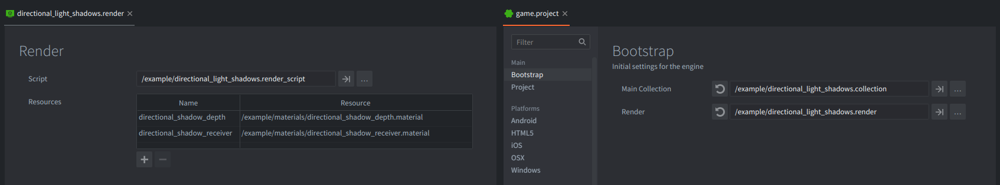
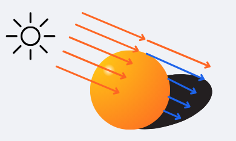
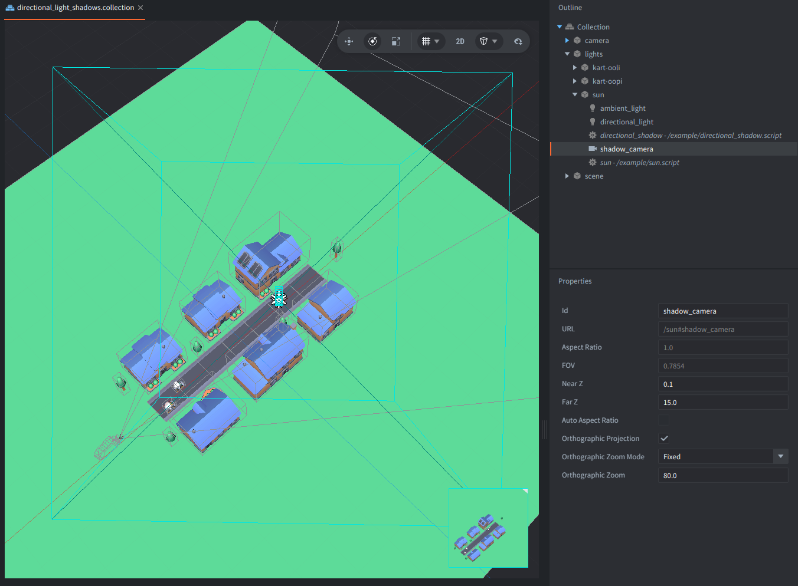
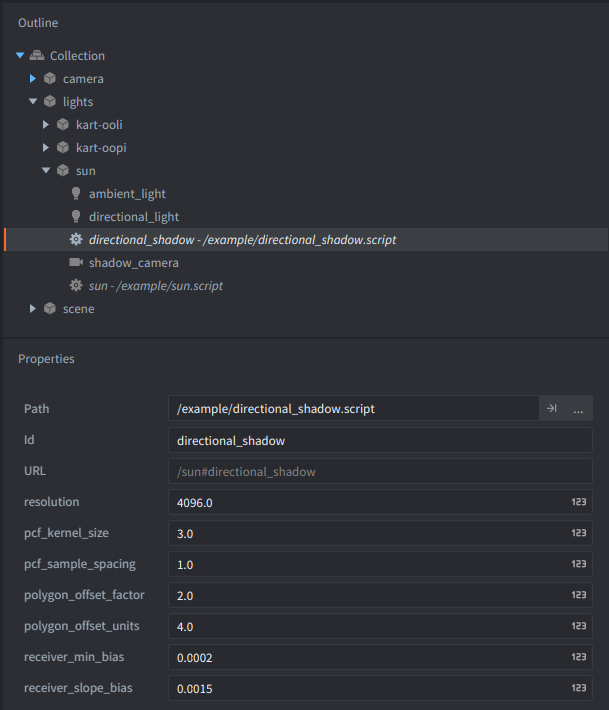
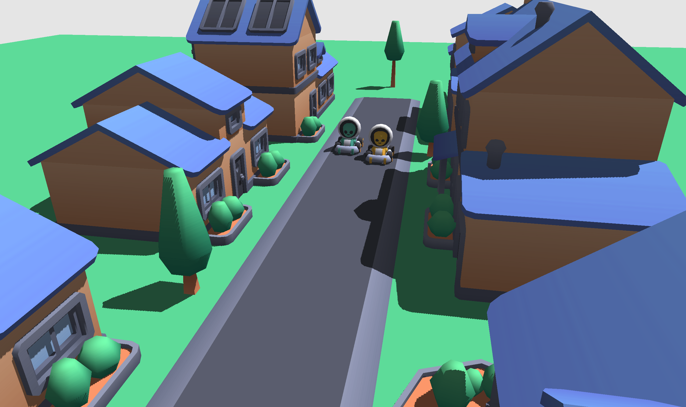
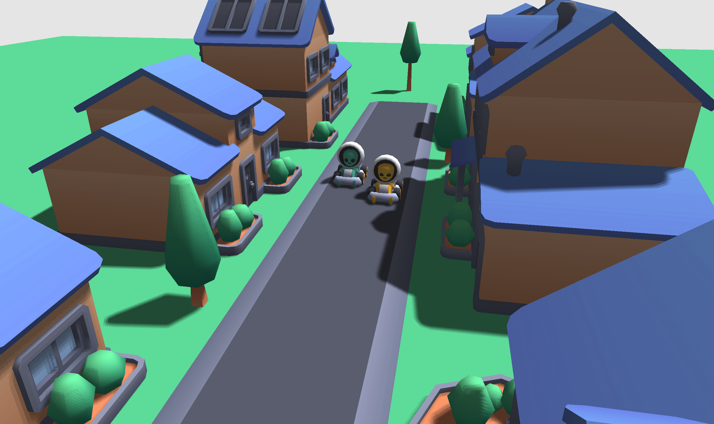

This example adds real-time shadows to a directional light and provides a custom render script for drawing shadows in a small 3D scene.

Drag with the mouse or touch to orbit the display camera, and scroll or pinch to zoom.

## What You'll Learn

- What shadow mapping is and how to add a shadow depth pass to a custom Defold render pipeline.
- How an orthographic Camera component defines the finite volume covered by a directional shadow map.
- How to render model depth from the light's point of view and compare it with visible fragments.
- How caster-side polygon offset and receiver-side depth bias reduce self-shadowing artifacts.
- How Percentage-Closer Filtering (PCF) softens pixelated shadow edges.
- How PCF kernel size and sample spacing affect quality and performance of shadows.
- How to use a separate `shadows.glsl` include in shaders for shadow related functions.

## Setup

The collection contains:

- `scene` game object with 3D models forming a small city
- `camera` game object with main camera to show the scene and a script to orbit and zoom the view
- `lights` game object with:

	- 2 game objects with 3D go-karts models with script that animate their position back and forth
	- `sun` game object with:

		- an ambient light component
		- a directional light component,
		- an orthographic `shadow_camera` component,
		- and `directional_shadow.script`.



Because the directional light and camera share a transform, they "look" in the same direction. The Camera component for the "sun" makes the shadow volume visible and editable in the editor.
The shadow camera has a near plane of `0.1`, a far plane of `15.0`, and an Orthographic Zoom of `80.0`. These values define the depth and area covered by the shadow map. Geometry outside this volume does not cast a shadow into the map, and visible fragments outside it are treated as lit.

The custom render resource registers two materials:

- a depth-only material for creating the shadow map;
- a lit receiver material for sampling it.

The materials are enabled only for their respective render passes. The receiver pass temporarily overrides the model material while keeping the model texture available through `tex0`.



The presentation models are from [Kenney asset packs](https://kenney.nl/assets/), licensed under CC0.

## How It Works

The `sun.script` slowly rotates the game object containing the directional light and shadow camera.
This demonstrates that the depth map is updated as the light direction changes.

### What is Shadow Mapping

Shadow mapping is a rendering technique used to determine which parts of a 3D scene are hidden from a light source.

It answers one question for each visible fragment: Can the directional light see this point?



In other words, it is about "looking" at the world precisely like the "shadow camera", so from a perspective of a light that casts these shadows. If something is not visible in this camera (occluded by other models), it means it is in shadow of this light.

The scene is first rendered from the light's perspective into a depth texture called a shadow map. Each texel stores the depth of the closest surface seen by the shadow camera.

During the main render pass, each visible world position is projected into the shadow map. The fragment's depth from the light is compared with the depth stored in the texture. If the fragment is farther away, another surface is between it and the light, so the fragment is in shadow.

An orthographic projection is acceptable for a directional light.

Note that the required matrices could be calculated manually from the light transform.
But this example uses a Defold Camera component instead because it makes the shadow volume easy to configure, understand and inspect directly in the editor:



### Shadow Properties

The script `directional_shadow.script` exposes the following game object properties:



#### `resolution`

Default: `4096`

Creates a square depth texture with the given width and height. For example, `4096` creates a 4096 x 4096 shadow map.

The value must be greater than `0`.

Common values are `1024`, `2048`, `4096`, and `8192`, but the best value depends on the scene and target hardware. A higher resolution can produce sharper shadows because more texels cover the shadow volume. It also uses more GPU memory, increases the work required to clear and render the depth map, and may exceed the maximum supported texture size on some devices.

#### `pcf_kernel_size`

Default: `3`

Selects one of three supported Percentage-Closer Filtering (PCF) kernel sizes:

- `1` — one depth comparison and a hard shadow edge; PCF filtering is effectively disabled;
- `3` — a 3 x 3 kernel with `9` depth comparisons per shadowed fragment;
- `5` — a 5 x 5 kernel with `25` depth comparisons per shadowed fragment.

PCF softens jagged, blocky shadow edges by sampling several nearby points and averaging whether those samples are lit or shadowed. A larger kernel produces more visibility levels along the edge, but costs more because the receiver shader reads the shadow map more often.

With `pcf_kernel_size = 1`, shadow texels are easy to see:



With a larger PCF kernel, the edge is smoother:



This example uses square kernels. Other sample patterns, such as a Poisson disk, can produce a different appearance.

#### `pcf_sample_spacing`

Default: `1.0`

Controls the distance between neighboring PCF samples, measured in shadow-map texels. It changes the area covered by the selected kernel, but it does not change the number of samples.

The value must be greater than or equal to `0.0`.

Examples:

- `0.5` places taps half a texel apart and produces a tighter filter footprint;
- `1.0` samples neighboring texels;
- `2.0` places taps two texels apart and produces a wider, more sparsely sampled transition.

Changing the spacing has little direct effect on performance because the selected kernel still performs the same number of samples. Very large values may have slightly worse texture-cache locality and can make the edge look banded or sparse.

A value of `0.0` makes every tap sample the same location. Use `pcf_kernel_size = 1` instead when filtering is not needed.

#### `polygon_offset_factor`

Default: `2.0`

Controls the slope-dependent part of the caster-side polygon offset used while writing the shadow map. It is especially useful on surfaces strongly angled relative to the light.

Increasing it can reduce shadow acne and visible triangle patterns, but excessive values can make shadows detach from their casters. This detached appearance of shadows is often called *Peter Panning*.

A value of `0.0` disables this part of the polygon offset. Non-negative values are normally the useful range for this setup.

#### `polygon_offset_units`

Default: `4.0`

Controls the more constant, depth-buffer-dependent part of the caster-side polygon offset.

Increasing it can remove remaining self-shadowing artifacts. If it is too large, contact shadows may move away from the objects that cast them.

A value of `0.0` disables this part of the polygon offset. The exact effect depends on the graphics backend and depth-buffer precision.

#### `receiver_min_bias`

Default: `0.0002`

Defines the minimum depth bias applied when the receiver shader compares a visible fragment with the stored shadow-map depth.

A value that is too small may leave shadow acne. A value that is too large can remove small contact shadows and separate the shadow from the caster.
Non-negative values are normally used.

#### `receiver_slope_bias`

Default: `0.0015`

Controls how much additional receiver bias is applied as a surface turns away from the light. Surfaces at a grazing light angle are more likely to suffer from depth precision artifacts, so they receive more bias.

Increasing this value can remove acne from angled surfaces. Excessive values can make shadows look detached or cause thin shadows to disappear. Non-negative values are normally used.

The caster-side polygon offset and receiver-side bias solve related problems at different stages of shadow mapping. Adjust them gradually rather than increasing several values by a large amount at once.

#### Sending the Properties to the Renderer

The script sends the camera URL and all shadow properties to the `@render:` socket from `init()` using a `set_directional_shadow` message. To change them at runtime, send the same message again with the new values. Changing `resolution` recreates the shadow render target.

`shadow_mapping.on_message()` stores the configuration and updates the material constants. Four scalar receiver settings are packed into one `shadow_params` vector:

```text
shadow_params.x = PCF kernel size: 1, 3, or 5
shadow_params.y = PCF sample spacing in texels
shadow_params.z = minimum receiver bias
shadow_params.w = slope-dependent receiver bias
```

`mtx_shadow` and `shadow_texel_size` remain separate because they represent different types of data.
`shadow_texel_size` converts offsets expressed in shadow-map texels into normalized texture coordinates.

### Render Script Integration

The implementation is split between the copied default built-in render script and `shadow_mapping.lua`.

The custom render script `directional_light_shadows.render_script` contains seven integration points:

1. Require `shadow_mapping.lua`.
2. Exclude the shadow camera when choosing the display camera.
3. Create the shadow context during render-script initialization.
4. Render the depth map before selecting the display camera.
5. Replace the default model draw with `shadow_mapping.render_models()`, which binds the depth texture and receiver material only for that draw.
6. Forward messages to the shadow module before handling the default renderer's messages.
7. Release the shadow render target from the render script's `final()` function.

The module exposes five integration functions: `init()`, `final()`, `on_message()`, `render_depth()`, and `render_models()`.

As a result, models are drawn once from the shadow camera to create the depth map and once from the display camera to draw the visible scene. The remaining render predicates continue normally after the model pass.

The example does not use texel snapping. It mainly stabilizes an orthographic shadow camera that translates through the world. Here the shadow camera stays in place and rotates with the directional light. Snapping one anchor point would not stabilize the rotating texel grid and could introduce visible jumps.

### Rendering the Depth Map

`shadow_mapping.render_depth()` reads the current view and projection matrices from the shadow Camera component, binds a depth-only render target, and draws all entries tagged `model` from the light's point of view.

Color writes are disabled because the shadow map needs only the nearest depth value seen by the light. Back-face culling is enabled, and the configurable polygon offset reduces self-shadowing artifacts while depth is written.

The function clears the selected Camera component with `render.set_camera()` and sets the shadow view and projection matrices explicitly with `render.set_view()` and `render.set_projection()`. After the depth pass, the default render target is restored, and the main render script selects the display camera.

The depth texture uses nearest filtering because the shader performs explicit depth comparisons for PCF. Linear filtering of a regular depth texture would interpolate raw depth values before the comparison, which can produce incorrect intermediate depths. Hardware-filtered depth comparison would require a different comparison-sampler implementation.

### Comparing Depth and Applying Shadows

The receiver vertex shader transforms each model vertex into world space and then into homogeneous shadow-texture space with:

```text
mtx_shadow = clip_to_texture_matrix * shadow_projection * shadow_view
```

The clip-to-texture matrix converts clip coordinates from `-1..1` to texture coordinates in `0..1`. It is sometimes called a bias matrix, but it is unrelated to the depth bias used to prevent shadow acne.

The fragment shader divides the interpolated shadow coordinate by `w`. Fragments outside the shadow camera volume are treated as lit.

For fragments inside the volume, the receiver bias is calculated from the surface normal and directional light direction. Surfaces facing the light use at least `receiver_min_bias`, while surfaces at grazing angles receive additional bias controlled by `receiver_slope_bias`. The biased receiver depth is then compared with the depth stored in the shadow map.

The selected kernel and sample spacing determine how nearby comparison results are combined into the final visibility value. The reusable implementation is kept in `shadows.glsl`. Its functions receive the shadow texture, coordinates, texel size, parameters, normal, and light direction through explicit arguments, so the include does not depend on variable names from the receiver shader.

The receiver material is based on Defold's built-in lit model shader and keeps the built-in `lighting.glsl` unchanged. Shadow visibility multiplies directional diffuse-light contributions only. Ambient, point, and spot light contributions continue to work normally.

### When This Technique Is Useful

A single directional shadow map is a good fit for:

- outdoor or indoor scenes with one main directional light, such as sunlight or moonlight;
- examples and projects that need real-time dynamic shadows without a complex renderer;
- scenes where one orthographic shadow volume can cover the important casters and receivers;
- rigid, opaque models using a compatible receiver material.

Its main advantages are:

- the technique is widely used and relatively easy to understand;
- the shadow volume can be edited visually with a normal Camera component;
- the depth pass stores only depth and does not require a color texture;
- quality and cost can be adjusted with resolution, kernel size, sample spacing, and bias controls;
- moving models and a rotating light update automatically because the depth map is rendered every frame;
- the reusable `shadows.glsl` functions can be included by other receiver shaders.

### Costs and Limitations

This example intentionally uses a simple and approachable implementation:

- Shadow-casting models must be rendered again for the depth pass, and larger PCF kernels increase the cost of the receiver fragment shader.
- One orthographic shadow map distributes its detail across the complete shadow volume. Very large outdoor view distances may need cascaded shadow maps, which use several maps for different distance ranges.
- Depth precision requires carefully tuned polygon offset and receiver bias values. PCF smooths sampled edges, but it does not create a physically correct soft-shadow penumbra.
- The example assumes one shadow map for the directional lighting setup. If several directional lights are active, the same shadow visibility is currently applied to every directional diffuse contribution. Separate shadow-casting directional lights need separate maps and light selection.
- All entries tagged `model` are rendered into the shadow map and drawn with the receiver material. A production project may use separate predicates for casters and receivers.
- The depth material supports rigid, opaque geometry. Skinned models, morph targets, vertex-deformed models, and instanced models may need depth shader variants that reproduce the same vertex deformation.
- Alpha-cutout geometry such as leaves, grass cards, and fences needs a depth material that samples alpha and discards transparent fragments. Otherwise the complete triangle casts a solid shadow.
- The receiver material is a simple lit model material. Projects using normal maps, PBR data, multiple textures, custom vertex attributes, or other shading models should include `shadows.glsl` in their own compatible receiver materials.
- The shadow map is regenerated every frame because the example rotates the light continuously. A project with static lights and static casters could cache and reuse it.
- The technique produces shadows from a directional light only. Point and spot light shadow maps require different camera projections and, in the case of point lights, usually several views.