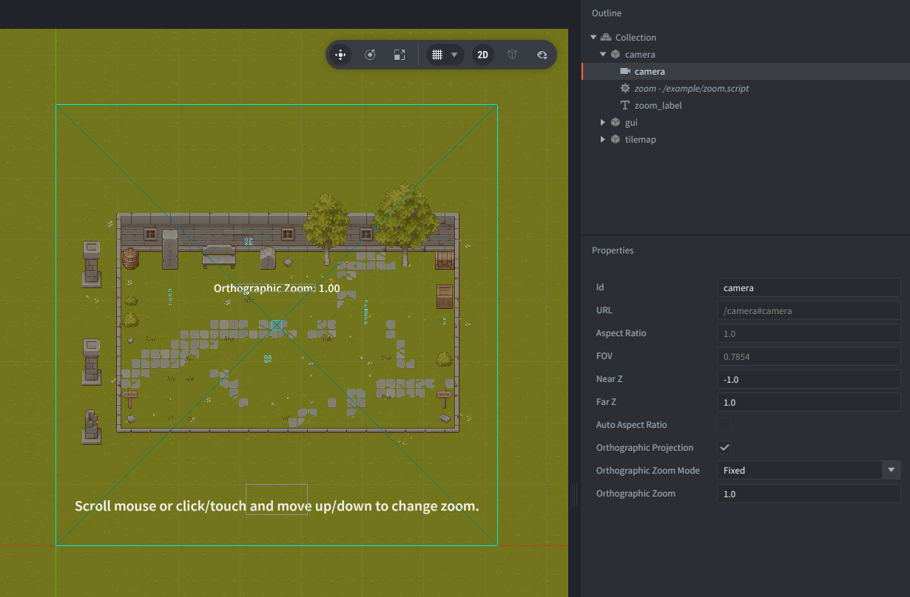

This example shows the recommended setup for gameplay zoom with an orthographic camera: keep the camera component in orthographic `Fixed` mode, then change `orthographic_zoom` from script.

## Setup

The setup consists of three parts:

- `camera` - game object containing the `camera` component, the `zoom.script`, and a `label` that displays the current zoom value. The `camera` component has `Orthographic Projection` enabled and `Orthographic Zoom Mode` set to `Fixed` with `Orthographic Zoom` set to `1.0` initially.

- `tilemap`- a simple level tilemap that makes the zoom effect easy to see as you move between a closer and wider view.

- `gui` - a GUI scene with a short instruction label describing the available controls.

## How it works

* Scrolling the mouse wheel changes the camera zoom in small fixed steps.
* Clicking or touching and moving up and down changes the zoom continuously based on the pointer delta.
* The script clamps the zoom between minimum and maximum values before writing it back to the camera component, so the example stays within a useful range.

Because the camera is in orthographic `Fixed` mode, the zoom behavior is controlled directly by the `orthographic_zoom` value instead of being recalculated by another orthographic mode.

## Credits

This project uses the following free art assets:
- Pixel Art Top Down Basic tilesets by Cainos: [https://cainos.itch.io/pixel-art-top-down-basic](https://cainos.itch.io/pixel-art-top-down-basic)
