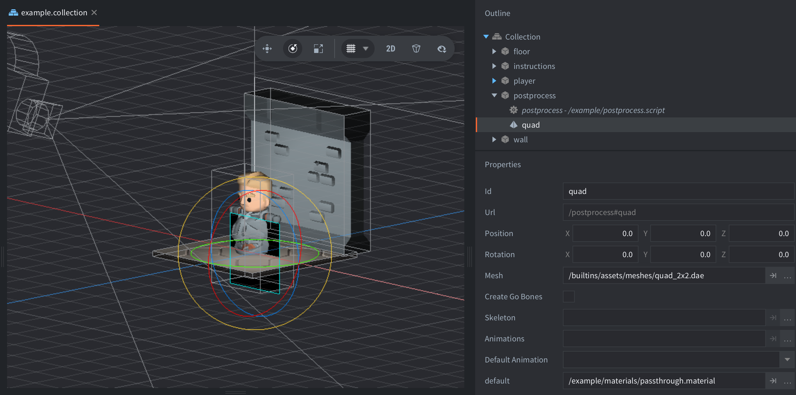
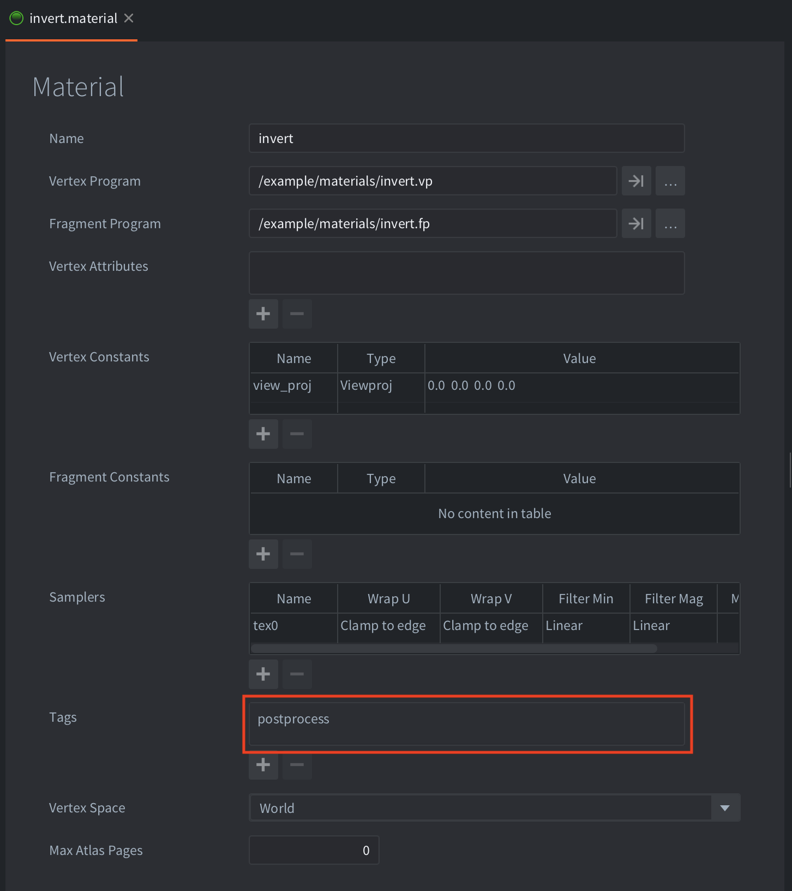
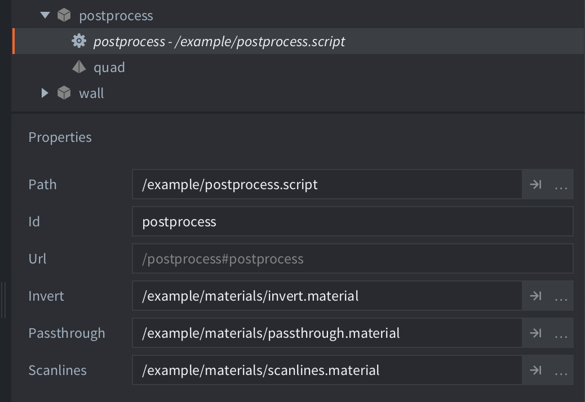

The basic principle of a full screen post processing effect is to first draw the entire game to a render target, then draw this render target to a full screen quad using a post processing shader to apply some kind of effect. This example shows a color invert effect and a CRT scanline effect.

The setup in this example consists of a custom render script and a game object containing a model component with a fullscreen quad (ie rectangle).



The model uses a material with a render predicate/tag named `postprocess`. The material uses a basic shader program in `invert.fp` to invert the color of anything drawn with the material.



The render script is a copy of the default render script with added code to create a fullscreen render target. The render target has a color and depth buffer, and it will be resized if the screen resolution changes:

```lua
local function create_postprocess_rt(self, width, height)
    local color_params = {
        format = graphics.TEXTURE_FORMAT_RGBA,
        width = width,
        height = height,
        min_filter = render.FILTER_LINEAR,
        mag_filter = render.FILTER_LINEAR,
        u_wrap = render.WRAP_CLAMP_TO_EDGE,
        v_wrap = render.WRAP_CLAMP_TO_EDGE
    }
    local depth_params = {
        format = graphics.TEXTURE_FORMAT_DEPTH,
        width = width,
        height = height,
    }
    self.postprocess_rt =  render.render_target("postprocess_rt", { [render.BUFFER_COLOR_BIT] = color_params, [render.BUFFER_DEPTH_BIT] = depth_params } )
    self.postprocess_rt_width = width
    self.postprocess_rt_height = height
end

local function update_postprocess_rt(self)
    local w = render.get_window_width()
    local h = render.get_window_height()
    
    -- keep render target if size is the same
    if self.postprocess_rt_width == w and self.postprocess_rt_height == h then
        return
    end

    render.delete_render_target(self.postprocess_rt)
    create_postprocess_rt(self, w, h)
end

function init(self)
    -- create the postprocess predicate and all of the default predicates
    self.predicates = create_predicates("postprocess", "tile", "gui", "particle", "model", "debug_text")

    create_postprocess_rt(self, render.get_window_width(), render.get_window_height())
end

function update(self)
    update_postprocess_rt(self)
end
```

The render script is additionally modified so that all content is drawn to the render target instead of directly to the screen. In a separate step at the end, the render target is used as a texture and drawn to the fullscreen quad with the `postprocess` predicate using the post processing shader assigned to the model quad:


```lua
function update(self)
    update_postprocess_rt(self)

    -- enable postprecssing render target
    -- subsequent draw operations will be done to the render target
    --
    render.set_render_target(self.postprocess_rt)

    -- note: some render code removed from this snippet to make it readable
    render.draw(predicates.model, draw_options_world)
    render.draw(predicates.tile, draw_options_world)
    render.draw(predicates.particle, draw_options_world)
    render.draw(predicates.gui, camera_gui.options)
    render.draw(predicates.debug_text, camera_gui.options)

    -- revert to the default render target
    --
    render.set_render_target(render.RENDER_TARGET_DEFAULT)

    -- render post processing render target to quad with predicate 'postprocess'
    --
    render.set_view(vmath.matrix4())
    render.set_projection(vmath.matrix4())
    render.enable_texture(0, self.postprocess_rt, render.BUFFER_COLOR_BIT)
    render.draw(predicates.postprocess)
    render.disable_texture(0)
end
```

Additionally the example shows in `postprocess.script` how to change material using material resource properties at runtime.



