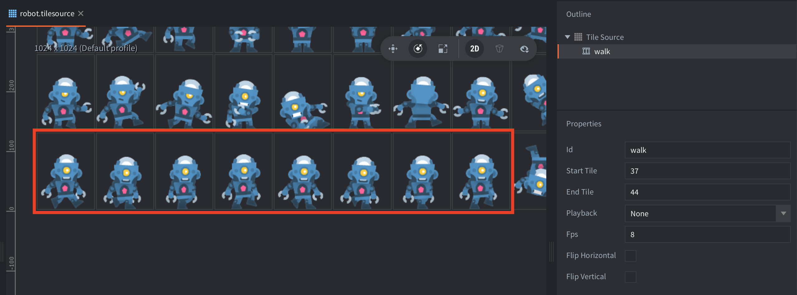
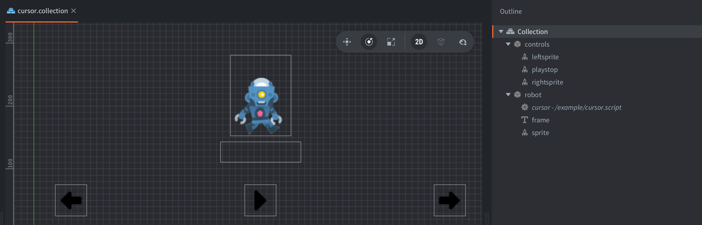

The example contains a sprite with a tilesource animation of a walking robot. The animation consists of 8 frames:

The example also contains a script and some visual controls that can be used to step through or automatically play the tilesource animation using the animation cursor:

