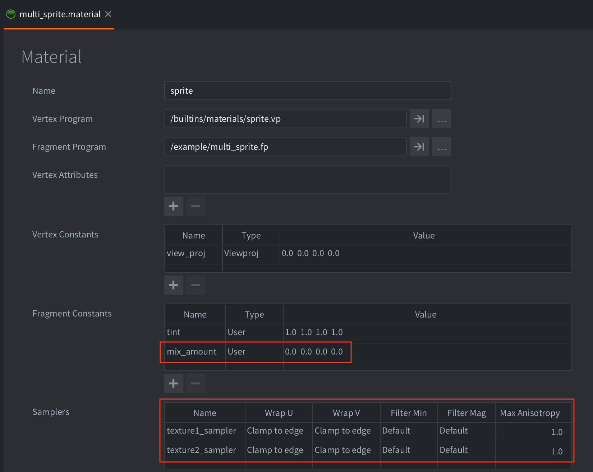
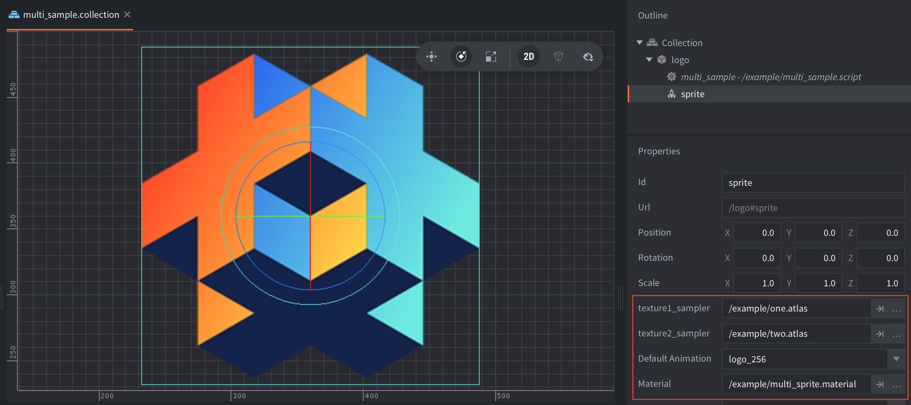

The example uses a sprite with a material with two samplers:

The samplers are assigned to two atlases, `one.atlas` and `two.atlas`:

Each atlas contains a Defold logo:

Note the rename pattern in `two.atlas`. The rename pattern is required so that it is possible to sample from the same location in both atlases. 

The color data from the two samplers is mixed/interpolated in the fragment program to produce a final color. The amount of interpolation is controlled in the `mix_amount` fragment constant. The `mix_amount` is animated between 0.0 and 1.0 in the `multi_sprite.script`
