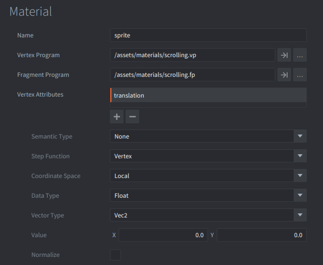
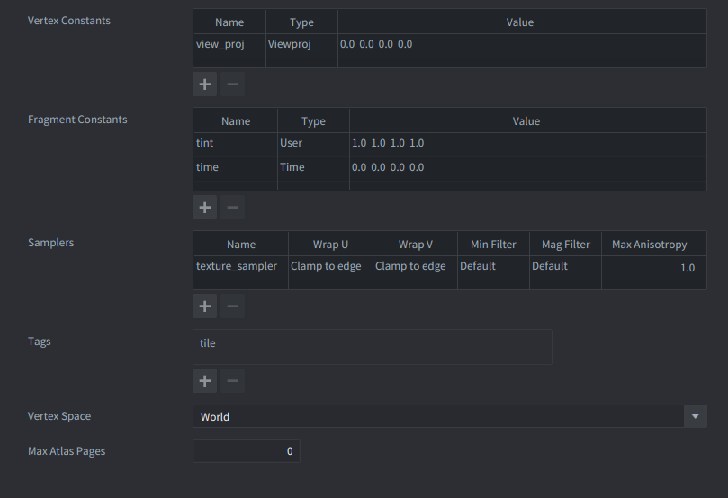
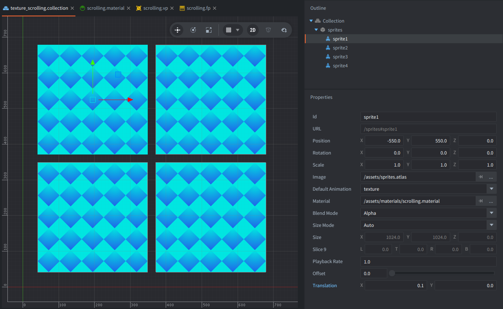

# Texture scrolling

This example shows how to achieve **scrolling textures (UV scrolling)** in Defold without moving the sprite in world space. Instead, UVs are modified in the fragment shader. It works both with plain textures and with an **atlas**, and the scrolling is performed **inside the current atlas region**.

Since Defold 1.12.3 a new semantic type for Attributes is available named **"Texture Transform 2D"**, and it is used in this example.

Since Defold 1.12.3 also time is provided automatically to the shaders via Fragment Constant of type **"Time"**, and it is used in this example.

## Material Setup

1. Create a new material: `example/scrolling.material`, with these important things set:

- **Vertex attribute** `translation` (vec2)
  - Vector Type: `Vec2` (for 2D)
  - This is the UV scroll vector - defining direction and speed, meaning: `translation = (vx, vy)` where positive `vx` scrolls towards +U, and positive `vy` scrolls towards +V.

- **Fragment constant** `time` of type `Time`
  - A material constant filled automatically by Defold.
  - In this example the fragment shader uses `time.x` as “time in seconds”, which is enough for simple scrolling.
  - Tint is left as is, as it's based on the built-in Sprite material.

## Sprite setup

In `example/texture_scrolling.collection`, there are 4 sprites that all use the `scrolling.material` and mainly differ by the Vertex Attribute for **translation**, to achieve different direction and speed:

- `(0.1, 0.0)` – scroll to the right
- `(0.1, -0.1)` – scroll diagonally (right + down)
- `(-0.1, 0.1)` – scroll diagonally (left + up)
- `(0.0, 0.1)` – scroll up

Notice, that visually it looks like the texture is moving in the **opposite** direction, because we are scrolling to the given direction the sampled texture.

To control per-sprite scroll speed/direction, **just change the `translation`** on that sprite in the editor (Vertex Attributes for Sprite components).

## Shaders overview

- **Vertex shader** `example/scrolling.vp`
  - Transforms sprite vertices to clip space using `view_proj`.
  - Forwards `texcoord0`, `texture_transform_2d`, and `translation` to the fragment shader.

- **Fragment shader** `example/scrolling.fp`
  - Derives the atlas tile origin (`atlas_pos`) and size (`atlas_size`) from `texture_transform_2d`.
  - Converts atlas UV into local tile UV (0..1).
  - Applies scrolling using `localUV += translation * time.x`.
  - Wraps inside the tile with `fract(localUV)` to keep sampling within the region.
  - Converts back to atlas UV and samples `texture_sampler`.
